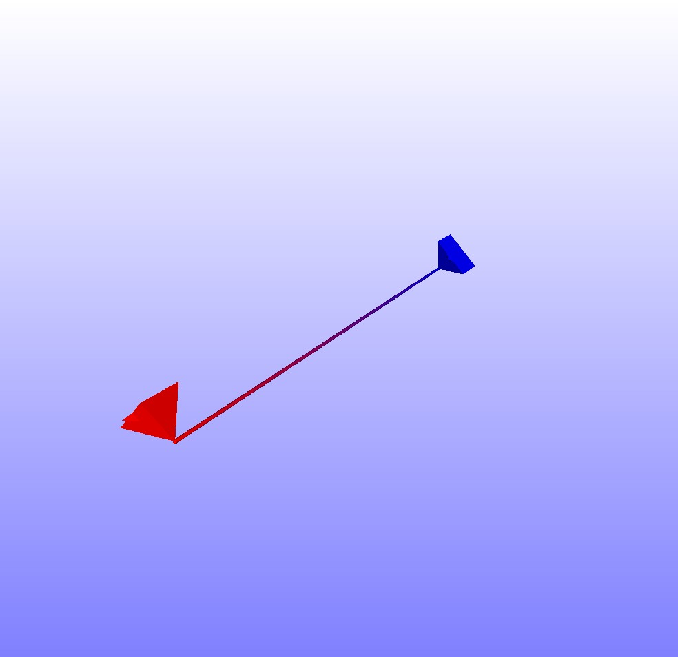
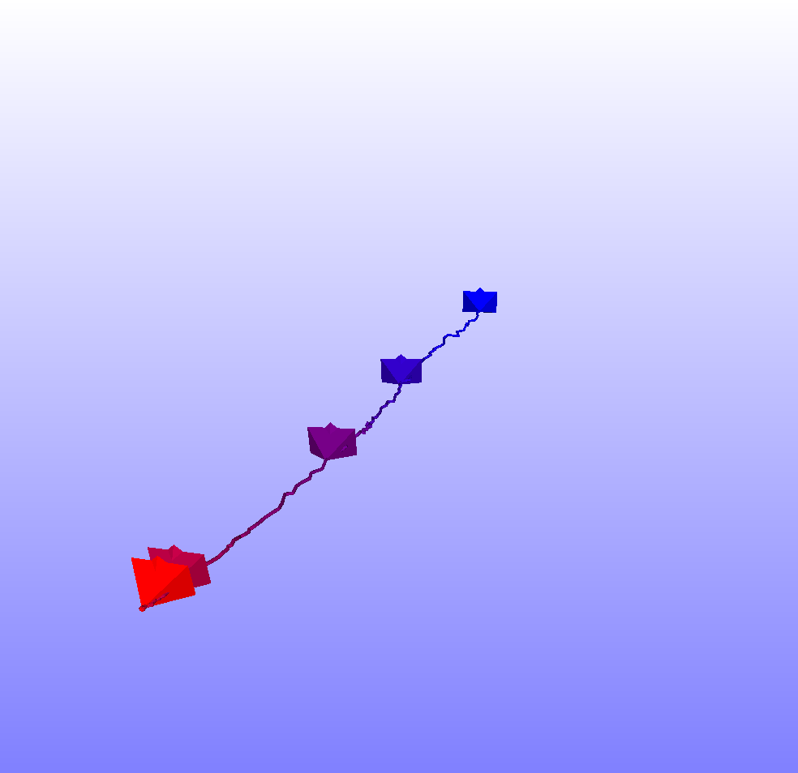
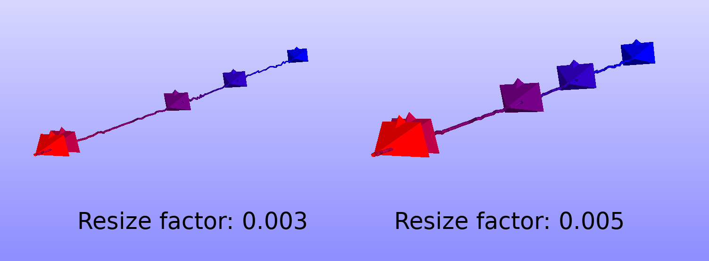
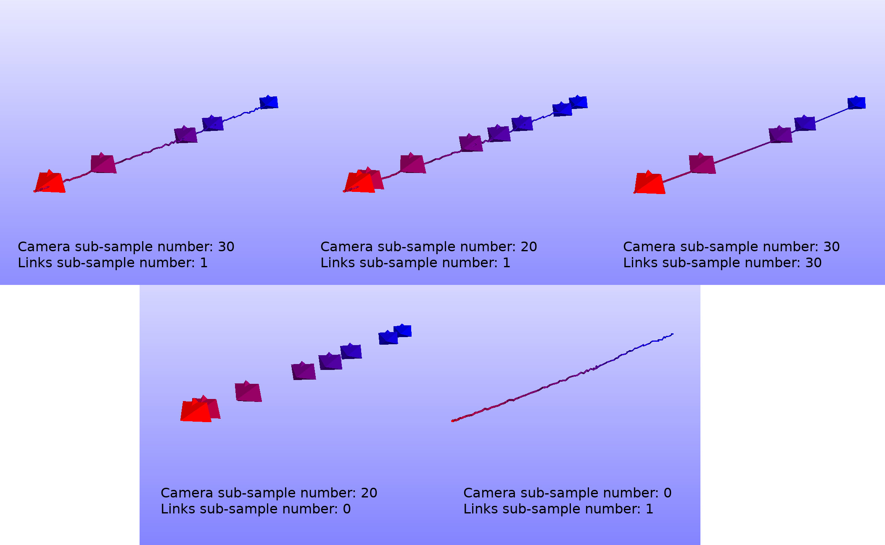
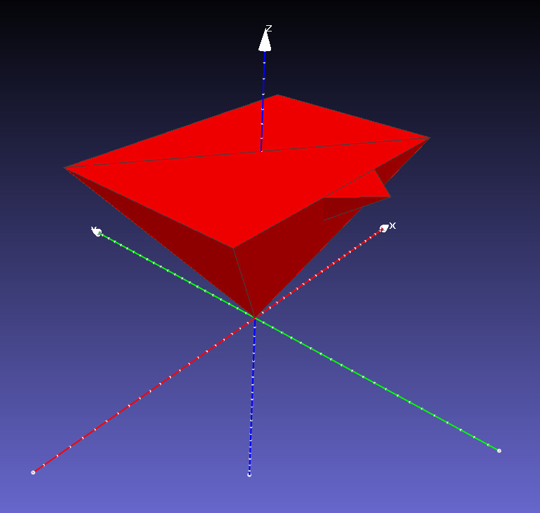
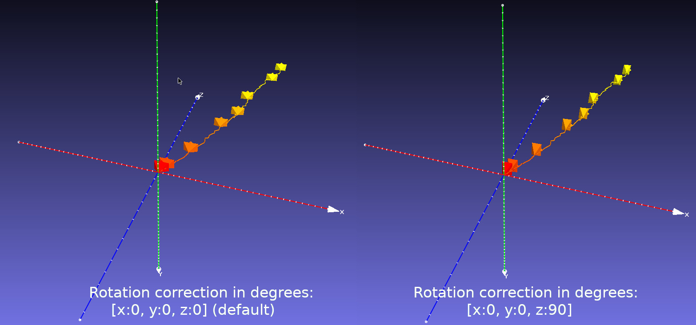

# Slam_viewer

**Slam_viewer** is an open source and header only multi-platform library to view the camera trajectory offline.  

<p align="center">

</p>


Some feature of the **slam_viewer** library:

* **Offline use**: Does not necessitates a running SLAM system to view the camera trajectory. It only uses the saved camera poses to show the path it took as showed in the figure above.

* **Gradiant colors**: The library uses a gradient between two colors in order to make it easy to distinguish between the start and the end of the trajectory.

* **Lightweight**: The library is defined in header files which is less than a thousand lines of code.
* **No dependency needed**: There are no dependencies beyond a compliant C++11 compiler and a small subset of the standard library.
* **Cross-platform compiled binaries**: For none c++ users, Windows and Linux binaries are provided with the simple  use instructions.

* **Ease of use**: Small self-contained code base, no external dependencies, permissive BSD-3 license.

* **Easy to integrate**: The library defines no symbols in the public namespace. It also provides a centralized single class to save the camera trajectory.


If you use this library, please cite our paper as shown below:

```
@inproceedings{kabbour2018human,
  title={Human Ear Surface Reconstruction Through Morphable Model Deformation},
  author={Kabbour, Salah Eddine and Richard, Pierre-Yves},
  booktitle={2018 Digital Image Computing: Techniques and Applications (DICTA)},
  pages={1--5},
  year={2018},
  organization={IEEE}
}
```

In the following we present the documentation of the library:

- [Usage modes](#Usage-modes)
  - [Including the header file](#including-the-header-file)
  - [Building the binary](#building-the-binary)
  - [Compiled binary](#compiled-binary)

- [Data format](#data-format)

- [Usage Options](#usages-options)

- [Advanced Usage](#advanced-usage)
  - [Camera orientation](#camera-orientation)
  - [Meshlab](#meshlab)

- [License](#license)

- [Special thanks](#special-thanks)

# Usage modes

The library's aim to produce a ```.ply``` file which can be viewed by an open source cross platform program called Meshlab ([https://www.meshlab.net/](https://www.meshlab.net/)).

Section [Meshlab](#meshlab) shows a simple way to use this program to produce powerful results.

The **Slam_viewer** library can be used in multiple modes as presented in the following:

## Including the header file

Integrating **Slam_viewer** library in the code can be done by including ```/slam_viewer/viewer.hpp```.

The API of the library is straight froward, The main function to use is ```Viewer::write_cameras_trajectory_to_ply_file``` which saves the camera trajectory to an output .ply file. 

The options used by the viewer class are explained in section [Usage Options](#usages-options).

```cpp
class Viewer {
public:
    Viewer(){}

    //! print all settings used by this class using std::cout
    void print_settings() const;

    //! resize factor is used to set the dimensions of the cameras and links between them
    void set_resize_factor(const float resize);

    //! link resize factor is used to set the dimensions of the links alone
    void set_resize_factor_for_links(const float resize_for_links);

    //! set the color of the first camera in RGB, each channel shoud be between 0 and 255
    void set_first_camera_color(const int r, const int g, const int b);

    //! set the color of the last camera in RGB, each channel shoud be between 0 and 255
    void set_last_camera_color(const int r, const int g, const int b);

    //! set how many cameras will be shown, 0 means no camera will be shown
    void set_cameras_downsample_factor(const int downsample);

    //! set how many links will be shown, 0 means no links between cameras will be shown
    void set_links_downsample_factor(const int downsample);

    //! each camera pose determine the orientation and the position of the camera in 3D
    void set_cameras_poses(const std::vector<Camera_pose>& cameras_poses);

    //! calculate the geometry of the cameras and save the 3D to a .ply file
    void write_cameras_trajectory_to_ply_file(const std::string output_path);

    //! if true then the class will print info message
    void set_verbose(const bool verbose);

    //! get the resize factor of cameras
    float get_resize_factor() const;

    //! ger camera poses from file, each line in the file should be on the form [... p.x p.y p.z q.x q.y q.z q.w] 
    static std::vector<Camera_pose> load_camera_poses_from_file(const std::string poses_file_path);
```

The following example illustrates a simple use case of the ```Viewer``` class:

```cpp
Slam_viewer::Camera_pose cam1;
cam1.p = {0, 0.5f, 1};  // camera position in the form: [x, y, z]
cam1.q = {0, 0, 0, 1};  // camera orientation in the form of quaternion: [x, y, z, w]
Slam_viewer::Camera_pose cam2;
cam2.p = {0, 1, 1};
cam2.q = {0, 0.7071068f, 0, 0.7071068f};

std::vector<Slam_viewer::Camera_pose> cameras = {cam1, cam2};


Slam_viewer::Viewer viewer;
viewer.set_cameras_poses(cameras);
viewer.write_cameras_trajectory_to_ply_file("trajectory.ply");
```

The result of the above example should give the following result:

<p align="center">

</p>

## Building the binary

An other option for the user to build the Slam_viewer standalone binary by compiling the files in  ```src/``` folder 
and using Cmake.

On linux this can be done by running the following commands:

```sh
mkdir build
cd build
cmake ..
make
```

The following section shows how to uses **slam_viewer** binary.

## Compiled binary

The compiled binary (slam_viewer) can be used to read Slam / camera trajectory data and save the the geometry to a .ply file. These binaries can be found in the folder ```compiled_binaries/```.

A first simple example of using the binary is displaying the program options by using the ```-h``` command:

```bash
./slam_viewer -h
```


This command will show the following result:

```
This program shows the trajectory of camera as .ply file
Usage:
  slam_viewer [OPTION...]

  -i, --input arg      Input file path (required)
  -o, --output arg     Output file path (default: ./slam_viewer_result.ply)
  -s, --subsample arg  Subsampling the number of cameras <int>: 0 means
                       cameras will not be shown. (default: 40)
  -k, --links arg      Subsampling the number of links between cameras <int>:
                       0 means links will not be shown. (default: 1)
  -r, --resize arg     Resizing camera cones <float>: 0 mean automatic resize
                       (default: 0.04)
  -a, --angle arg      Applied rotation according to x->y->z axis in degrees
                       (default: 0,0,0)
  -f, --first arg      First camera color [r, g, b] (default: 255,0,0)
  -l, --last arg       Last camera color [r, g, b] (default: 0,0,255)
  -v, --verbose        Show verbose messages
  -h, --help           Print this help
```

The options used by the **slam_viewer** binary are explained in section [Usage Options](#usages-options).

Let us show an other example of using the binary to plot the result of a camera trajectory. We provide some camera data to be used as example.
To use the binary for this purpose one can execute the following command:

 ```bash
 slam_viewer -i <input-file-path> -o <output-file-path> 
 ```
 
 Applying the command from the project directory can be done as follows:
 
 ```bash
./build/slam_viewer -i ./trajectory_data/150_frames.txt -o trajectory.ply -r 0.003
 ```
 
 The output of the above example should give the following result:
 
 <p align="center">

</p>

# Data format

Each camera frame is characterized by a pose: position and orientation. The position is defined by its 3D coordinates **x**, **y** and **z**. However the Rotation in 3D can be defined by a 3-by-3 rotation matrix, axis-angle rotation, Euler XYZ rotation vector or by a Quaternion. The following website [https://www.andre-gaschler.com/rotationconverter/](https://www.andre-gaschler.com/rotationconverter/) can be used for different rotation representations conversion.

In our library, only Quaternions are supported. There exist two methods of loading data to the viewer class:

### Using the Library's API

The following function is used to tell the viewer class the position and the orientation of the different cameras:

```cpp
Viewer::void set_cameras_poses(const std::vector<Camera_pose>& cameras_poses)
```

In the following we show the different data structure used as input for this function:

```cpp
struct Position {
    float x, y ,z;
};
struct Quaternion {
    float x, y, z, w;
    inline Quaternion operator*(const Quaternion& q1) const;
    inline void from_euler_in_degrees(const float rx, const float ry, const float rz);
};
struct Camera_pose{
    Position p;
    Quaternion q;
};
```

### Using binary / library to load data from text file

We also provide a method to load poses directly from a file.

This is done by calling the static function:

```cpp
std::vector<Camera_pose> load_camera_poses_from_file(const std::string poses_file_path)
```

Or using the binary ```-i <file-path>``` command line.

Each line in the file represents a camera pose, and all values should be separated by a space.
So each line should be in the form:
```
[... p.x p.y p.z q.x q.y q.z q.w]
```

With ```p``` means the position, and ```q``` means the orientation in Quaternion. The ```...``` could be anything and will be neglected by the loading function.

# Usage Options

There are multiple options to using the library, the following list explains the use of each option:

* **1. Resizing Cameras**: Resizing the camera is used to in order to adapt the camera cones size to that of the 3D structure.

The default value of the camera size is **0.04**, which can be changed by calling the function ```Viewer::set_resize_factor``` or by running binary command option ```./slam_viewer -r <size>```. PS: camera links size is proportional to that of the camera geometry.

<p align="center">

</p>

* **2. Camera sub-sampling**: Sometimes camera frames are too close in trajectory and need to be sub-sampled. This can be done by calling ```Viewer::set_cameras_downsample_factor``` function or by command option ```./slam_viewer -s <factor>```. A sub-sample factor of 3 means that one in three camera frames is shown.

* **3. Link sub-sampling**: Same as the previous one, this one is used to sub-sampling links between camera frames. This can be done by calling ```Viewer::set_links_downsample_factor``` function or by command option ```./slam_viewer -k <factor>```. A sub-sample factor of 3 means that one in three links is shown.

<p align="center">

</p>

* **4. Cameras colors**: In order to identify the beginning of the camera trajectory and the end of it, a camera color gradient is used. The color of each camera and link is automatically calculated from the first and the last camera colors. The first camera  default color is red (255, 0, 0) and the last one is blue (0, 0, 255). These option can be changed by calling the functions ```Viewer::set_first_camera_color``` and ```Viewer::set_last_camera_color``` or by the command ```./slam_viewer -f <first_color> -l <last-color>```. For example  ```./slam_viewer -f 255,255,0 -l 0,255,255``` will set the first camera color to Yellow and the last one to Aqua.

<p align="center">

</p>


* **5. Verbosity**: The user has the choice to display function messages or to hide them. By default no message is shown, this can be changed by calling the function ```Viewer::set_verbose(true)``` or by running binary command option ```./slam_viewer -v```.


# Advanced Usage


## Camera orientation

Camera orientation by default is directed toward the z-axis. The following figure shows a camera at position ```[x:0, y:0, z:0]``` and with the default orientation which is  equal to the Quaternion ```[x:0, y:0, z:0, w:0]``` :

 <p align="center">

</p>

It is worth mentioning that the top of the camera is facing the opposite direction of the y-axis, this choice has been made to accommodate the fact that most image analysis programs inverse the y-axis while indexing pixels in an image. In other words, the bottom left pixel on a image has a positive **y** coordinate.

If the user wishes to change the default orientation of the camera, this can be achieved by following one of these two methods:

* **Including the library**: The orientation of the camera can be changed  by applying the same oration on all camera poses. To achieve this, we have to multiply each pose Quaternion with the same correction Quaternion. 

To illustrate this, the following example shows how to apply 90 degree angle change to the z-axis:

```cpp
std::vector<Slam_viewer::Camera_pose> poses;
poses = Slam_viewer::Viewer::load_camera_poses_from_file(".../path_to_frames_file.txt");
                
Slam_viewer::Quaternion correction;

correction.from_euler_in_degrees(0, 0, 90);

for(auto& pose: poses){
    pose.q = pose.q * correction;
}
```


* **Using the binary**: Applying a rotation to all cameras can be done by using the command ```-a <rx>,<ry>,<rz>```. If we take the same example, applying 90 degree angle change to the z-axis is done by ```./slam_viewer -a 0,0,90```. 
 <p align="center">

</p>

## Meshlab

Meshlab ([https://www.meshlab.net/](https://www.meshlab.net/)) is an open source system for processing and editing 3D triangular meshes.
It can read an render multiple 3D file formats include '.ply' used by our library. 

The following figure shows a simple way to view the camera trajectory alongside with the 3D surface data reconstructed from the same set of camera frames:

<p align="center">

</p>


# License

We use a permissive BSD-3-Clause License  which allows easy integration of our library in any project ever if it is closed source. However we motivate other developers to contribute to this open source project.

# Special thanks

At the end we would like to give thanks to developers of two open source Github projects that has been used in ```Slam_viewer```:

* **linalg.h** : Which is a header only library used for linear algebra computation in our library (link: [https://github.com/sgorsten/linalg](https://github.com/sgorsten/linalg)).

* **cxxopts** : Which is also a header only library used to process program options for our slam_viewer binary (but not used in the our library) (link: [https://github.com/jarro2783/cxxopts](https://github.com/jarro2783/cxxopts)).

Both These projects have permissive license which integrates well with BSD-3.