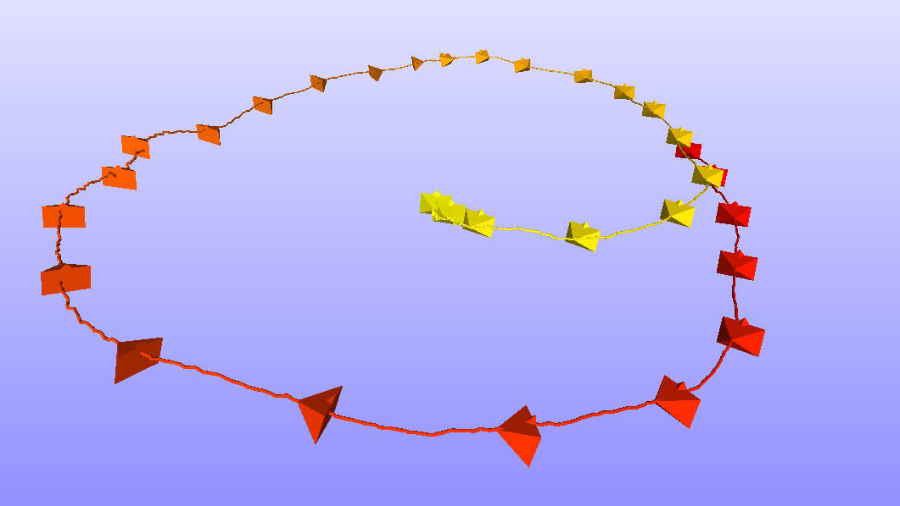

# Slam_viewer

**Slam_viewer** is an open source and header only multi-platform library to view camera trajectory offline.  

Some feature of the **slam_viewer** library:

* **Offline use**: Does not necessitates a running SLAM system to view the camera trajectory. It only uses the saved camera poses to show the path it took as showed in the figure below.

* **Gradiant colors**: The library uses a gradient between two colors in order to make it easy to distinguish between the start and the end of the trajectory.

* **Lightweight**: The library is defined in header files which is less than a thousand lines of code.
* **No dependency needed**: There are no dependencies beyond a compliant C++11 compiler and a small subset of the standard library.
* **Cross-platform compiled binaries**: For none c++ users, Windows and Linux binaries are provided with the simple  use instructions.

* **Ease of use**: Small self-contained code base, no external dependencies, permissive BSD-3 license.

* **Easy to integrate**: The library defines no symbols in the public namespace. It also provides a centralized single class to save the camera trajectory.

<div style="text-align:center"></div>

If you use this libraries, please cite our paper as shown below:

```
@inproceedings{kabbour2018human,
  title={Human Ear Surface Reconstruction Through Morphable Model Deformation},
  author={Kabbour, Salah Eddine and Richard, Pierre-Yves},
  booktitle={2018 Digital Image Computing: Techniques and Applications (DICTA)},
  pages={1--5},
  year={2018},
  organization={IEEE}
}
```

In the following we present the documentation of the library:

- [Usage modes](#Usage-modes)
  - [Including the header file](#including-the-header-file)
  - [Building the binary](#features)
  - [Compiled library](#features)

- [Usage Options](#usages-options)

- [Advanced Usage](#advanced-usage)
	- [Camera orientation](#camera-orientation)
	- [Meshlab](#meshlab)

- [License](#license)

- [Special thanks](#special-thanks)

# Usage modes

The library's aim to produce a ```.ply``` file which can be viewed by and open source cross platform program called [Meshlab](https://www.meshlab.net/).

Section [Meshlab](#meshlab) shows a simple way to use this program to produce powerful results.

The **Slam_viewer** library can be used in multiple modes as presented in the following:

## Including the header file